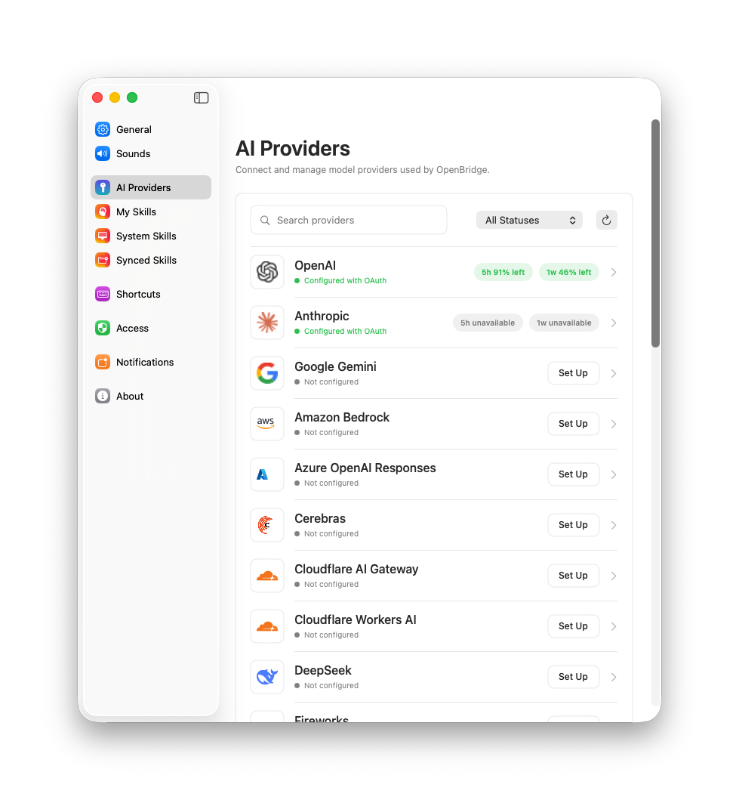

<p align="center">
  
</p>

# OpenBridge

<p align="center">
  
</p>

OpenBridge is a macOS-first local agent chat app for running coding and productivity agents on your own machine. It combines a native SwiftUI shell, embedded React chat surfaces, a vendored `kwwk` agent runtime, Bring Your Own Key model providers, local skills, and a sandbox VM workflow for reviewing file changes before they touch the host filesystem.

> [!NOTE]
> OpenBridge is intentionally local-first. Provider credentials are stored under the app's Application Support data, agent state is local, and the sandbox VM is managed by the desktop app instead of a hosted backend.

## Product Highlights

### Use Your Existing Coding Agent Subscriptions

OpenBridge can connect to third-party coding-agent subscriptions such as Codex and Claude Code, so you can run local agent sessions with the providers and models you already use.

<p align="center">
  
</p>

### Track Multiple Tasks in the Notch

Keep multiple agent runs visible at once through the macOS notch task UI, with live status for active, waiting, and completed work.

<p align="center">
  
</p>

### Let Agents Operate Your Computer

Computer Use lets an agent inspect and operate local macOS apps after explicit approval, then automatically exits the session when the run completes or is cancelled.

<p align="center">
  
</p>

### Review Sandbox Changes Before They Touch Your Files

Agent file edits happen in a sandbox first. You can inspect every proposed change, accept only what you want, or discard the run without modifying your host filesystem.

<p align="center">
  
</p>

## What It Does

- Native macOS chat experience with SwiftUI windows, notch task UI, menus, sounds, and settings.
- Embedded WebView chat rendering for streaming Markdown, tool calls, file diffs, and review cards.
- Local agent execution through vendored `kwwk`, with OpenBridge-owned auth resolution and model selection.
- AI provider management for OAuth and API-key based providers, including OpenAI, Anthropic, Google Gemini, and related provider variants.
- Skills loaded from `~/.openbridge/skills`, bundled system skills, synced folders, imports, and user-created skills.
- Sandbox VM execution with per-session environments, overlay-backed file changes, and accept/reject review.
- Local memory, schedules, task status, title generation, and workspace preview flows.

## Architecture

```text
OpenBridge.app
├─ macOS SwiftUI/AppKit shell
│  ├─ Agent sessions, settings, skills, memory, schedules
│  ├─ AI provider registry and credential resolver
│  └─ WebKit bridge to embedded React surfaces
├─ web embedded assets
│  ├─ Chat renderer
│  └─ Preview renderer
├─ kwwk
│  └─ Vendored agent SDK and coding-agent runtime
└─ sandbox-vm
   ├─ Go local VM runtime framework
   ├─ Virtualization.framework Linux VM control
   ├─ Per-session sandbox environments
   └─ Workspace diff, preview, accept, and discard
```

### Repository Layout

| Path | Purpose |
| --- | --- |
| `macos/` | SwiftUI macOS application, native UI, settings, local agent orchestration, and WebKit integration. |
| `web/` | React/TypeScript embedded WebView assets for chat and preview surfaces. |
| `kwwk/` | Vendored local agent SDK/runtime used by OpenBridge. Keep it broadly useful and avoid product-specific concepts where possible. |
| `sandbox-vm/` | Go sandbox VM control library and macOS runtime framework. |
| `docs/` | Design notes for local VM sandboxing, skills, and review flows. |
| `scripts/` | Shared utility scripts. |

## Key Concepts

### Local Agent Runtime

OpenBridge creates one local agent session per conversation. The Swift layer owns product state and UI events, while `kwwk` handles the coding-agent loop. OpenBridge provides the system prompt, tool set, provider auth resolver, and model selection instead of depending on a hosted service.

### AI Providers

Provider settings live in the app and support OAuth or API-key credentials. Model selection is filtered to enabled providers, and credentials are resolved at agent runtime before requests are forwarded to the real provider.

OpenBridge supports provider brands across subscription, direct API, OpenAI-compatible, Anthropic-compatible, and gateway routes, including OpenAI, Anthropic, Google Gemini, Amazon Bedrock, Azure OpenAI, GitHub Copilot, DeepSeek, OpenRouter, xAI, Groq, Cerebras, Fireworks, Hugging Face, Mistral AI, Cloudflare AI Gateway, Cloudflare Workers AI, Vercel AI Gateway, Kimi, Moonshot AI, MiniMax, OpenCode, Xiaomi, Z.ai, and custom OpenAI-compatible endpoints.

### Skills

Skills are local capability packages with a `SKILL.md` entry point. OpenBridge scans system, custom, imported, and synced skills, advertises active skills to the agent, and expects the agent to read matching `SKILL.md` files only when a task needs them.

### Sandbox VM

The sandbox VM uses one shared VM host with separate sandbox environments per OpenBridge session. File edits happen in overlay-backed environments and appear in the chat as reviewable workspace changes. Users can accept selected files, accept all, or discard changes.

## Prerequisites

- macOS with Apple Virtualization.framework support
- Xcode and Xcode command line tools
- Go 1.24+
- Node.js with Corepack/Yarn
- `make`
- `protoc` when changing VM RPC protobufs

## Quickstart

From a fresh worktree, initialize submodules, build the embedded web assets, then build the macOS app.

```bash
git submodule update --init --recursive
```

```bash
cd web
yarn install --immutable
yarn build:embedded
```

```bash
cd ../sandbox-vm
make framework
```

```bash
cd ../macos
BUILD_CONFIGURATION=UnsignedDebug bash DevKit/Scripts/workspace_build_debug.sh
```

Launch the unsigned debug app:

```bash
pkill -f '/OpenBridge.app/Contents/MacOS/OpenBridge' || true
open -na "$(pwd)/.build/DerivedData/Build/Products/UnsignedDebug/OpenBridge.app"
```

## Development Workflow

### Embedded WebViews

Use the local dev server for chat-only frontend iteration:

```bash
cd web
yarn serve:chat
```

Rebuild and relaunch the macOS app only when native Swift code, JS bridge contracts, or packaged WebView resources change.

### macOS App

```bash
cd macos
BUILD_CONFIGURATION=UnsignedDebug bash DevKit/Scripts/workspace_build_debug.sh
bash DevKit/Scripts/workspace_test_unit.sh
```

### Sandbox VM

```bash
cd sandbox-vm
make framework
make go-test
```

Use `make vm` only when rebuilding local VM resources such as `kernel.bin` and `rootfs.img`.

### Web Checks

```bash
cd web
yarn lint
yarn typecheck
yarn test
```

### Root Make Targets

For common local checks from the repository root:

```bash
make bootstrap
make check
make macos-build
```

## Documentation

- [`macos/README.md`](macos/README.md) - macOS app structure and agent integration points.
- [`web/README.md`](web/README.md) - embedded WebView package commands and source layout.
- [`sandbox-vm/README.md`](sandbox-vm/README.md) - sandbox VM package responsibilities and build targets.
- [`docs/ARCHITECTURE.md`](docs/ARCHITECTURE.md) - high-level app, web, agent runtime, and sandbox boundaries.
- [`docs/SANDBOX_VM.md`](docs/SANDBOX_VM.md) - local VM isolation, workspace state, and accept/reject review flow.
- [`docs/SKILLS.md`](docs/SKILLS.md) - skill package model, prompt contract, sources, and UI behavior.

## Project Status

OpenBridge is under active development. The current focus is making the local agent loop, provider configuration, skill prompt behavior, sandbox review workflow, and native macOS UI match the intended local-first product model.

## License

OpenBridge is released under the [MIT License](LICENSE).
